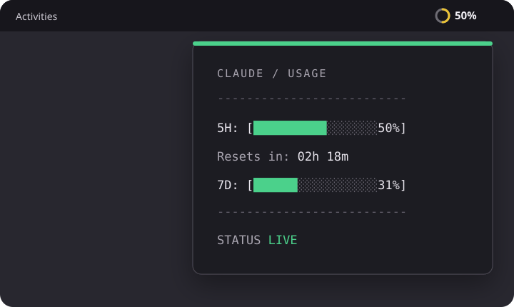

# Clausage

A small GNOME Shell indicator for Claude Code usage. The top bar always shows the current five-hour usage percentage; the menu adds weekly usage and the five-hour reset countdown.

Unofficial project. Not affiliated with or endorsed by Anthropic.



## Preview

    CLAUDE / USAGE
    --------------------------
    5H: [████████░░░░░░░░░ 42%]
    Resets in: 02h 18m
    7D: [██████░░░░░░░░░░░ 31%]
    --------------------------
    STATUS  LIVE

    [ REFRESH NOW ]

The ring and percentage use green below 50%, yellow from 50% through 85%, and red above 85%.

## Requirements

### Windows 10
- Python 3.9 or newer (with `pip` available in PATH)
- Claude Code installed and signed in
- Internet access to Anthropic's usage endpoint

### Linux (GNOME)
- GNOME Shell 42
- Python 3
- Claude Code installed and signed in
- Internet access to Anthropic's usage endpoint

Only GNOME Shell 42 is declared because it is the version currently tested. GNOME 45 and newer require a separate ES-module port.

## Windows install

1. Clone or download this repository.
2. Run `install_windows.bat` (double-click or run from a terminal).
   - Installs `pystray` and `Pillow` via pip.
   - Writes a launcher to your Startup folder so Clausage starts automatically on login.
3. The tray icon appears in the notification area (bottom-right, near the clock). Click `^` to expand hidden tray icons if needed.

To start Clausage immediately without logging out, run:

```
pythonw tray.py
```

To remove Clausage from startup, run `uninstall_windows.bat`, then quit the running instance via its tray panel.

### Windows usage

- **Left-click** the ring icon to open the usage panel.
- The panel shows 5-hour usage, reset countdown, weekly usage, and live/cache status.
- Click **Refresh Now** inside the panel to fetch fresh data; the panel stays open while refreshing.
- Click anywhere outside the panel to dismiss it.
- **Right-click** the icon for a minimal menu with a Quit option.

## Linux install (GNOME)

### Install a release

1. Download `clausage@pedroelizalde01.github.com.shell-extension.zip` from GitHub Releases.
2. Run `gnome-extensions install --force clausage@pedroelizalde01.github.com.shell-extension.zip`.
3. Reload GNOME Shell: on X11 press `Alt+F2`, type `r`, and press Enter; on Wayland sign out and back in.
4. Run `gnome-extensions enable clausage@pedroelizalde01.github.com`.

### Install from source

Run `./install.sh`, reload GNOME Shell as described above, then enable the extension with `gnome-extensions enable clausage@pedroelizalde01.github.com`.

## Status values

- `LIVE`: Usage came directly from Anthropic.
- `CACHE / NETWORK`: The network request failed and the last successful result is shown.
- `CACHE / AUTH`: Claude Code's access token is unavailable or expired and the last result is shown.
- `AUTH`: No valid token or cached result exists. Open Claude Code and sign in or let it refresh the session.
- `ERROR`: Python could not run or returned invalid output. Use **Refresh now** after correcting the problem.

## Security and privacy

Clausage reads Claude Code's access token from `~/.claude/.credentials.json` and sends it only to `https://api.anthropic.com/api/oauth/usage`. It never modifies that credentials file, logs the token, stores a copy, or places it in command-line arguments or environment variables.

The latest usage response is cached with mode `0600` at `$XDG_CACHE_HOME/clausage/usage.json` (normally `~/.cache/clausage/usage.json`) so the indicator remains useful while offline. Clausage has no telemetry.

The usage endpoint and Claude Code credential format are not public stable APIs and may change without notice.

## Development

Run checks with `node --check extension.js`, `node test_extension.js`, `python3 -m unittest -v`, and `python3 usage.py --self-check`.

Build the release bundle with `zip -j clausage@pedroelizalde01.github.com.shell-extension.zip extension.js usage.py metadata.json`.

## Uninstall

Run `gnome-extensions uninstall clausage@pedroelizalde01.github.com`. If your GNOME version does not remove local extensions, delete `~/.local/share/gnome-shell/extensions/clausage@pedroelizalde01.github.com` after disabling it.

## License

GPL-3.0-only. See `LICENSE`.
